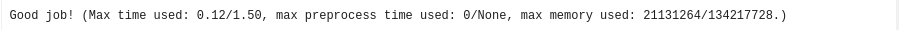

# spreadsheet_cpp
Final work of C++ course

Spreadsheet engine with formulas parser and evaluator.

Uses ANTRL for building abstract syntax tree.

Russian version of task [Task details](info/task.pdf)

My code is a little faster, and consumes less memory than course author's work.

Mine:


Authors:



# Installation

To instul on Debian & Ubuntu

```
sudo apt-get install cmake ninja-build pkgconf uuid-dev
```

From src directory:

```
mkdir build && cd build

cmake .. -Wno-dev -DCMAKE_BUILD_TYPE=Debug -G Ninja -DWITH_LIBCXX=Off 

ninja
'''

